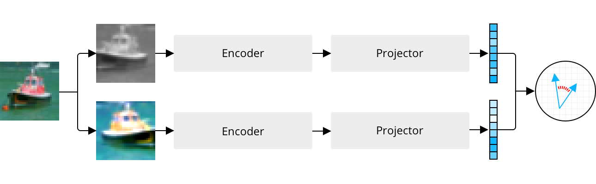

# VICReg on CIFAR-10



This repo is associated with the blog post ["Learning Self-Supervised Image Representations With VICReg"](https://sigmoidprime.com/post/vicreg/) over at [sigmoid prime](https://sigmoidprime.com/). It contains an implementation of the [VICReg](https://arxiv.org/abs/2105.04906) training procedure applied on CIFAR-10 with a ResNet-18 backbone and is thus feasible to run on a single GPU. After 500 epochs of pre-training, the model achieves an accuracy of ~87% in linear evaluation (this will almost certainly improve if you increase the number of pre-training epochs).

Since CIFAR-10 is much smaller than ImageNet, a few simplifications have been made to the training process:

1. We use an encoder dimension of 512 and projector dimension of 1024. This is in contrast with 2048 and 8192, respectively, in the original paper.
2. Since the batch size is small (256), we use Adam, not LARS. The authors emphasize that VICReg doesn't require large batch sizes, so LARS shouldn't be too important anyway.
3. Linear evaluation is performed using 50 finetuning epochs instead of 100.

The model and training procedure are simple. We first instantiate our model:

```python
device = torch.device("cuda" if torch.cuda.is_available() else "cpu")
encoder_dim, projector_dim = 512, 1024
model = VICReg(encoder_dim, projector_dim).to(device)
```

We then load CIFAR-10, setting the `transform` parameter to an instance of the `Augmentation` class, which produces two augmented versions for each image in a batch:

```python
data = CIFAR10(root=".", train=True, download=True, transform=Augmentation())
dataloader = DataLoader(data, batch_size, shuffle=True, num_workers=2)
```

The inner loop of the training process is defined as follows:

```python
for images, _ in dataloader:
    x1, x2 = [x.to(device) for x in images]
    z1, z2 = model(x1, x2)

    la, mu, nu = 25, 25, 1
    var1, var2 = variance(z1), variance(z2)
    inv = invariance(z1, z2)
    cov1, cov2 = covariance(z1), covariance(z2)
    loss = la*inv + mu*(var1 + var2) + nu*(cov1 + cov2)

    opt.zero_grad()
    loss.backward()
    opt.step()
```

If you would like to pre-train the model beyond 500 epochs, you can download a 500-epoch checkpoint [here](https://sigmoidprime.s3.eu-central-1.amazonaws.com/vicreg/checkpoint.pt). All you need to do is move it to the root of the directory and run `python3 train.py`.
