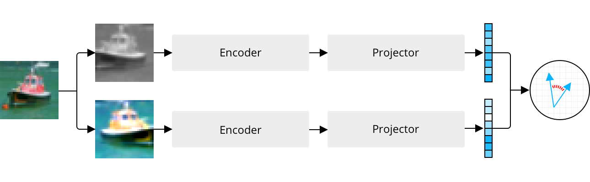

# VICReg on CIFAR-10

This repo is associated with the blog post ["Self-Supervised Learning With VICReg"](https://sigmoidprime.com/post/vicreg/) over at [sigmoid prime](https://sigmoidprime.com/). It contains an implementation of the VICReg training procedure applied on CIFAR-10 with a ResNet-18 backbone and is thus feasible to run on a single GPU. The method was proposed by Adrien Bardes, Jean Ponce, and Yann LeCun in the paper ["VICReg: Variance-Invariance-Covariance Regularization for Self-Supervised Learning"](https://arxiv.org/abs/2105.04906) (2022).
